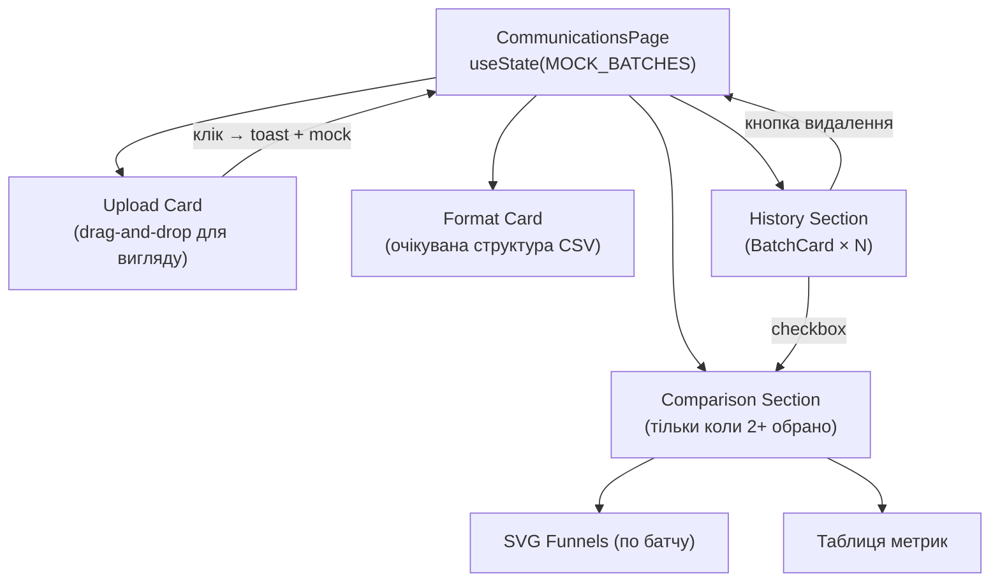

# Вкладка "Комунікації" — план реалізації

> Статус: реалізовано  
> Остання зміна: 23.02.2025

---

## Що змінюється / змінено

- [`src/config/nav-config.ts`](../src/config/nav-config.ts) — новий пункт навігації
- [`src/hooks/use-breadcrumbs.tsx`](../src/hooks/use-breadcrumbs.tsx) — хлібні крихти
- [`src/components/icons.tsx`](../src/components/icons.tsx) — іконка для вкладки
- [`src/app/dashboard/communications/page.tsx`](../src/app/dashboard/communications/page.tsx) — вся логіка і UI

---

## Підхід: статичний прототип

Тільки mock дані і `useState`. Ніякого файлового завантаження, ніякого парсингу, ніякого localStorage.

```typescript
const [batches, setBatches] = useState<CommBatch[]>(MOCK_BATCHES);
```

`MOCK_BATCHES` — 3 pre-loaded зразкових завантаження, сторінка одразу наповнена. Кнопка "Завантажити" — стилізована drag-and-drop зона. Клік показує `toast` і додає `EXTRA_MOCK_BATCH` до стану.

---

## Структура даних

```typescript
interface CommRow {
  customerId: string; // унікальний ID клієнта для звʼязування з внутрішньою системою
  name: string;       // назва комунікації
  channel: string;    // Email | SMS | Push | Viber | Інше
  sent: number;
  delivered: number;
  opened: number;
  clicked: number;
  converted: number;
}

interface CommBatch {
  id: string;
  name: string;
  uploadedAt: string;  // дата у вигляді рядка для mock
  rows: CommRow[];
}
```

---

## Очікуваний формат CSV (показується користувачу)

| Колонка       | Тип   | Приклад         | Обов. |
| ------------- | ----- | --------------- | ----- |
| `customer_id` | рядок | CL-00142        | ✓     |
| `campaign_id` | рядок | CMP-001         | ✓     |
| `name`        | рядок | Email про акцію | ✓     |
| `channel`     | рядок | Email           | ✓     |
| `sent`        | дата  | 18.02.2025      | ✓     |
| `delivered`   | дата  | 18.02.2025      | —     |
| `opened`      | дата  | 19.02.2025      | —     |
| `clicked`     | дата  | 19.02.2025      | —     |
| `company`     | рядок | Rozetka         | —     |

Один рядок = один клієнт. `customer_id` — унікальний ідентифікатор клієнта; `campaign_id` — унікальний ідентифікатор маркетингової кампанії (обовʼязково). `sent` — дата надсилання (обов'язково); `delivered`, `opened`, `clicked` — дати подій (порожньо, якщо не відбулось). `converted` не потрібен — розраховується на бекенді.

Допустимі значення каналу: `Email`, `SMS`, `Push`, `Viber`, `Інше`

---

## Архітектура сторінки



---

## Блоки UI сторінки

### 1. Верхній рядок — 2 колонки

- **Upload Card** — drag-and-drop зона (тільки стилізована), клік → `toast` + `EXTRA_MOCK_BATCH` до стану
- **Format Card** — таблиця з описом колонок CSV, кнопка "Зразок" генерує реальний `.csv` через `Blob` для завантаження

### 2. History Section

Грід `BatchCard` по кожному батчу:
- назва + дата
- к-сть sent (k), overall conv%
- прогрес-бари Доставка / Відкриття / Переходи
- Badge'і каналів
- чекбокс для порівняння + кнопка видалення

### 3. Comparison Section (з'являється якщо обрано 2+)

- Таблиця метрик з підсвіткою найкращого значення (`✓` + зелений) по кожній колонці
- SVG-воронки для кожного вибраного батчу (аналог `SvgFunnel` з `/dashboard/cashback`)
- Мінікартки з Open Rate / Click Rate / Conv Rate / Overall Conv під кожною воронкою

---

## Конверсійні метрики

```
Delivery Rate  = delivered / sent     × 100
Open Rate      = opened   / delivered × 100
Click Rate     = clicked  / opened    × 100
Conv Rate      = converted / clicked  × 100
Overall Conv   = converted / sent     × 100
```

---

## Іконка і навігація

- Іконка: `IconMailForward` з `@tabler/icons-react`, ключ `communications`
- Shortcut: `['c', 'c']`
- Маршрут: `/dashboard/communications`
- Breadcrumb: `Dashboard → Комунікації`

---

## Потенційні доробки

- [ ] Реальний парсинг CSV через `FileReader` (без залежностей) або `papaparse`
- [ ] Preview modal перед підтвердженням імпорту
- [ ] Фільтрація history по каналу / даті
- [ ] Recharts bar chart для порівняння метрик між батчами
- [ ] Деталізація по окремій кампанії (розгортання рядків батчу)
